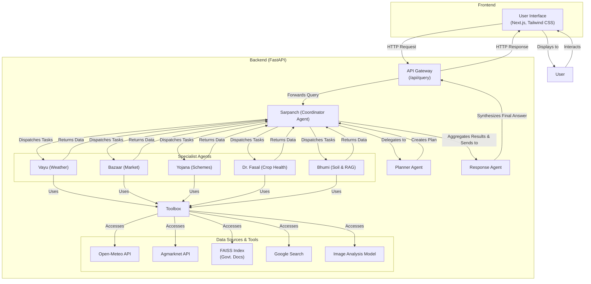

# Agri-Sahayak: AI-Powered Agricultural Assistant
Agri-Sahayak is a comprehensive, AI-driven platform designed to empower farmers with real-time data, expert knowledge, and multilingual support. This full-stack solution combines a powerful backend, featuring a sophisticated multi-agent system, with an intuitive, user-friendly frontend to deliver critical agricultural information and assistance.

## Deployed Version
[https://agri-sahayak-frontend-9duk.vercel.app/] 

## Architecture and Workflow
The Agri-Sahayak platform utilizes a decoupled architecture with a Next.js frontend and a FastAPI backend. At the core of the backend is a multi-agent system orchestrated by a central coordinator, ensuring that user queries are handled by the most appropriate expert agent.



## Workflow:

1. **User Interaction**: A farmer interacts with the platform's frontend, submitting a query in their preferred language, which could include text and images.

2. **API Communication**: The Next.js frontend sends the query to the backend's /api/query endpoint.

3. **Coordination**: The Sarpanch (Coordinator Agent) receives the query. It acts as the central hub, managing the entire workflow.

4. **Planning**: The Sarpanch passes the query to the Planner Agent, which breaks down the complex query into a sequence of specific tasks.

5. **Task Delegation**: The Sarpanch reviews the plan and dispatches each task to the most suitable specialist agent from the team.

6. **Specialist Execution**: Each specialist agent executes its task using a shared set of tools, which interface with external APIs and internal knowledge bases.

7. **Data Aggregation**: The specialist agents return their findings to the Sarpanch, which collects and aggregates all the information.

8. **Response Synthesis**: The Sarpanch forwards the aggregated data to the Response Agent, which synthesizes a coherent, comprehensive, and user-friendly answer in the user's original language.

9. **Final Output**: The synthesized response is sent back to the frontend and displayed to the farmer.

## Features
### Frontend
- 🌍 Multi-Language Support: Supports English, Hindi, Punjabi, Marathi, Telugu, and Tamil, with complete UI localization.

- 📊 Market Data Visualization: Interactive charts for commodity price trends and market quantities with robust filtering.

- 🌤️ Weather Forecast & Insights: Real-time, agriculture-specific weather data and smart insights using the Open-Meteo API.

- 💬 AI Chat Interface: A multi-language chat interface with voice input/output capabilities for seamless interaction.

### Backend
- **🤖 Sophisticated Multi-Agent System**: A collaborative team of AI agents ensures expert handling of diverse queries.

- ** Conversational AI**: Advanced natural language processing for all agricultural queries.

- **Real-time Data**: Access to live market prices, weather forecasts, and agricultural information.

- **Crop Health Analysis**: Multi-modal image analysis for plant disease diagnosis.

- **RESTful API**: Comprehensive endpoints for both conversational AI and direct data access.

### The Multi-Agent Team
The backend's intelligence is driven by a team of specialized AI agents, each with a distinct role.

- **Sarpanch (Coordinator)**: The master agent that oversees the entire process. It receives the initial query, manages the workflow by coordinating with the planner and specialists, and ensures a final, high-quality response is generated.

- **Planner Agent**: The strategist of the team. It analyzes the user's query and creates a step-by-step plan for the specialist agents to follow.

- **Vayu (Weather Specialist)**: Provides detailed weather forecasts, historical data, and climate information relevant to farming activities.

- **Bazaar (Market Analyst**): Delivers real-time commodity prices, market trends, and historical price analysis from various markets.

- **Yojana (Policy Specialist)**: Offers information about government schemes, subsidies, and agricultural policies.

- **Dr. Fasal (Crop Doctor)**: A multi-modal agent that analyzes images of crops to diagnose diseases, identify pests, and recommend treatments.

- **Bhumi (Soil & Knowledge Specialist)**: Focuses on soil health, crop management, and retrieves in-depth information from the internal knowledge base using a Retrieval-Augmented Generation (RAG) system.

- **Response Agent**: The communicator of the team. It takes the structured data from all the specialists and crafts a final, easy-to-understand, and conversational response for the user.

## Technology Stack
### Frontend
- **Framework**: Next.js 14 with TypeScript

- **Styling**: Tailwind CSS

- **Charts**: Chart.js with react-chartjs-2

- **State Management**: React Context

- **Core Dependencies**: next, react, chart.js, date-fns

### Backend
- **Framework**: FastAPI

- **Multi-Agent Framework**: Agno, LangGraph

- **Database**: FAISS for the vector store, Postgres for document mapping.

- **Core Dependencies**: fastapi, uvicorn, google-generativeai, faiss-cpu, langchain, langgraph

### AI & Machine Learning
- **LLM**: Google Gemini

- **Knowledge Base**: FAISS-powered RAG system for efficient information retrieval.

## Setup and Installation
### Prerequisites
- Node.js 18+

- npm or yarn

- Python 3.8+

- Google API Key (for Gemini)

- Data.gov.in API Key (optional)

- Tavily API (for tavily search)

### Frontend
- Navigate to the frontend directory: 
```bash
cd frontend
```
- Install dependencies:
```bash
  npm install
```

- Run the development server:
```bash
npm run dev
```
- The application will be available at
```bash
  http://localhost:3000.
```

### Backend
- Navigate to the backend directory: cd backend

- Install dependencies: pip install -r requirements.txt

- Create a .env file with your API keys:
```python
GOOGLE_API_KEY=your_google_api_key_here
DATA_GOV_API_KEY=your_data_gov_api_key_here
TAVILY_API_KEY=your_tavily_api_key_here
DEBUG=False
HOST=0.0.0.0
PORT=8000
```
- Build the knowledge base:
```python
  python ingest.py
```
- Run the application:
```python
python main.py
```

## API Endpoints
### Backend
- Conversational AI:
``` POST /api/query ```

- Direct Data Access:
```bash
GET /api/data/commodities

POST /api/data/prices

POST /api/data/weather
```

System Information:
```bash
GET /

GET /api/agents

GET /docs (Interactive API documentation)
```
